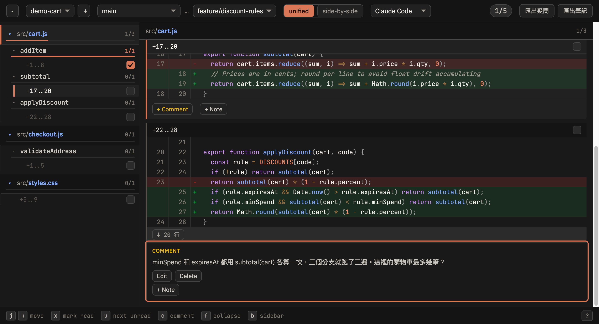

# AI CodeReview Helper

在沒有 GitHub 的環境下，取得 PR review 的核心體驗：**看過的地方打勾、有疑問的地方留言、中斷後接著看**。

跑在本機、一個瀏覽器分頁，服務多個專案。



上圖是一次進行中的 review：左樹把改動切成 檔案 → function → 變更點，
`addItem` 已經看完（打勾、進度條滿），`subtotal` 還沒，`applyDiscount` 留了一則疑問。
`styles.css` 不是 JS，自動降級成兩層。底部是鍵盤操作提示。

---

## 它解決什麼

一條 fix branch 相對 base 有一千多行改動、集中在兩三個大檔。你需要逐段讀完，
記住哪些看過了、哪些還沒，並把疑問記下來。純看 `git diff` 做不到這件事。

這個工具把 diff 切成**檔案 → function → 變更點**三層，讓你能勾到「某個 function 裡的某一處改動」。

| 粒度 | 為什麼不行 |
|---|---|
| 整個檔案 | 一個檔 1000 行，勾了等於沒勾 |
| 一個 hunk | 大改寫時一個 hunk 可以 241 行、橫跨多個 function |
| **function 內的單一改動** | ← 這個工具用的 |

進度用內容雜湊記錄，所以 rebase 或 `--amend` 之後行號全變，**內容沒變的勾會留著**；
被改掉的那段自動回到未讀（它真的變了，該重看）。

---

## 安裝與啟動

需要 Node.js 20 以上。

```bash
git clone <這個 repo>
cd ai-codereview-helper
npm install
node review.js
```

開 http://localhost:7777

第一次使用時，用頂列的 `+` 貼上你要 review 的 repo 絕對路徑。之後從下拉切換。

**Port 固定 7777**，被佔用時會直接報錯而不是換 port——這樣書籤永遠有效。

---

## 怎麼用

選好 base 與 target 之後，右側一次顯示一個檔案，從左樹切換。

| 鍵 | 動作 |
|---|---|
| `j` / `k` | 下一個 / 上一個變更點（會跨檔案）|
| `x` | 標記已讀（勾起來時自動前進；取消勾不動）|
| `u` | 跳到下一個**未讀**（會跨檔案）|
| `c` | 對這個變更點留 comment |
| `f` | 折疊 / 展開所在 function |
| `1` / `2` | unified / side-by-side |
| `b` | 收合側邊欄 |
| `?` | 快捷鍵速查表 |
| `space` | 沒有綁定，就是正常捲動 |

**展開脈絡**：每個間隙上下都能拉，一次 20 行，或一次到底。讀起來像在看整份檔案，
但展開的行只是脈絡——不能勾、不計入進度、不進入 `j`/`k` 的順序。

**Comment 與 Note 的差別**在於匯出：

| | 意思 | 匯出疑問（Claude）| 匯出筆記（Markdown）|
|---|---|---|---|
| Comment | 我不確定，要查 | ✓ | ✓ |
| Note | 我看懂了，記給自己 | ✗ | ✓ |

「匯出疑問」只帶有 comment 的變更點，每則附檔案絕對路徑、所在 function 的完整原始碼、
diff 與你的問題——貼進 AI 對話就能直接查證。把已理解的筆記也塞進去會稀釋重點，
所以 note 刻意排除。

兩種匯出都複製到剪貼簿，不寫檔。

---

## Ref 的語意

- 兩端都選 ref 時：`git diff <base>...<target>`（**three-dot**，從共同祖先算起，PR review 的標準語意）
- target 選 **Working Tree** 時：`git diff <base>`，含未 commit 的改動

Working Tree 模式下 diff 會隨你編輯而變，勾也會跟著失效——**這是設計，不是 bug**。
內容變了就代表那段該重看。

---

## 資料放哪

```
~/.local-code-review/
  config.json          repo 清單
  state/<repo-id>.json 每個 repo 的勾選、comment、note
```

在你的家目錄，**不會寫進被 review 的專案**，不會污染 working tree、也不怕誤 commit。

每個人各自一份，不互相共享。

---

## 安全須知

**不要把監聽位址改成 `0.0.0.0` 或對外開放。**

這個工具能讀取你註冊的任何 git repo 的檔案內容，包含未 commit 的工作區。
它假設只有本機的你會連線——綁定 `localhost` 是刻意的，不是疏漏。

---

## 支援的語言

`.js` / `.mjs` / `.cjs` / `.jsx` 會用 acorn 解析出 function 邊界，得到三層結構。

其他語言（`.css`、`.java`、`.jsp`…）自動降級成兩層：檔案 → 變更點。仍然可以正常 review，
只是少了 function 這一層。

要新增語言支援，只需實作 `functions.js` 的合約：吃檔名與內容、吐
`[{ name, startLine, endLine }]`，不認識的副檔名回 `[]`。其他模組一行都不用改。

---

## 技術取捨

無框架、無 build step。前端是原生 ES modules，改一行存檔重整就看到。
後端只用 Node 內建的 `node:http`。

只有兩個相依，都零傳遞相依、都 vendor 在 `public/vendor/`，離線可用：

- `acorn` — 解析 function 邊界。用 regex 數大括號會在 regex literal、字串裡的 `{`、
  巢狀 closure 上**靜默算錯**，而 review 工具最不該犯這種錯
- `prismjs` — 語法上色

字體同樣 vendor 在本機，不連 CDN。

設計決策與被否決的方案記在 `docs/superpowers/specs/`，開發過程記在 `docs/dev-log/`。

---

## 測試

```bash
npm test
```

後端六個模組都是純邏輯，不用開瀏覽器就能測。前端是 DOM 程式碼，靠實際開瀏覽器逐條驗收。
